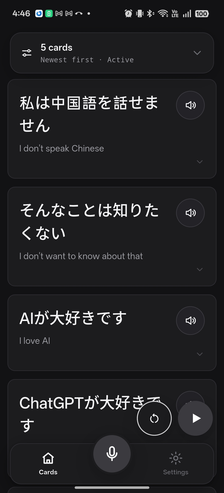
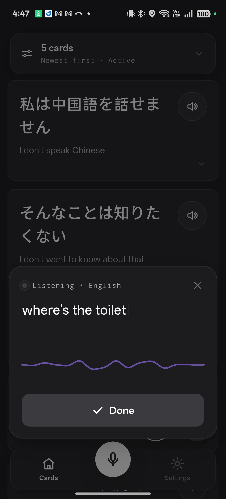
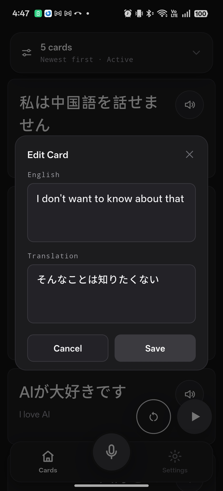
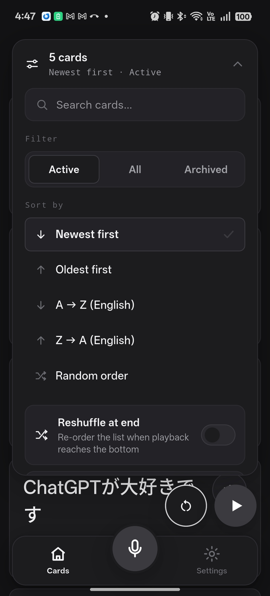
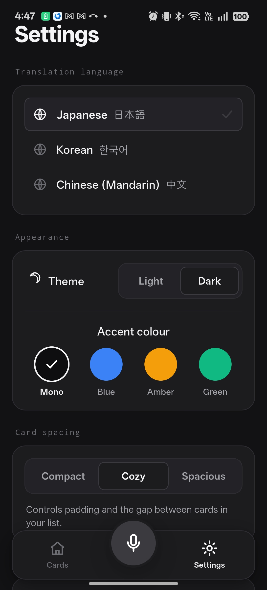

# EchoLearn

A mobile language-learning app for dictation, translation, and spaced listening practice. Built with Flutter.

> **v0.3.0** · Early development — expect rough edges. See the [release notes](https://github.com/sqooid/echolearn-app/releases/tag/v0.3.0).

## Features

- **Dictation** — Speak a phrase in English; speech-to-text captures your words live.
- **Multi-language translations** — Translate into Japanese, Korean, or Mandarin Chinese and keep each language side by side. Switch languages from Settings; switching marks the cards that are missing the new language as untranslated so they can be translated on demand.
- **On-demand translation** — Translate a whole missing set at once from Settings ("Translate N cards"), or a single card from its own Translate button.
- **TTS audio** — Synthesized audio for each translation, stored locally for offline playback.
- **Playback queue** — Play all cards sequentially with configurable shadowing delays. Pause/resume preserves position; a reset button restarts from the beginning. Untranslated cards are skipped.
- **Card management** — Archive, restore, edit, and delete. Expand a card for metadata. Delete a single card's translation for the current language without losing the others. Search, filter (Active / All / Archived, plus a show-untranslated toggle), and sort by newest, oldest, A–Z, Z–A, or shuffle.
- **Backup & restore** — Export the whole database to a file and restore it later, using non-destructive schema migrations.
- **Theme & layout** — Light/dark themes, accent colors (Mono, Blue, Amber, Green), and card density presets (compact, cozy, spacious).
- **Persistent storage** — SQLite database for cards, translations, audio blobs, and settings. Pending cards retry automatically on next launch.
- **Configurable API** — Base URL via `--dart-define=API_BASE_URL=...`, API key stored in settings.

## Screenshots

| Cards | Record | Edit | Filters | Settings |
|---|---|---|---|---|
|  |  |  |  |  |

## Requirements

- **Flutter** ≥ 3.12
- A companion server that exposes these endpoints at the configured URL:

  ```
  POST /translate   { text, from, to } → { text }
  POST /tts         { text, language } → audio/mpeg
  ```

  Both endpoints accept an optional `x-api-key` header.

## Getting started

```bash
# Clone and install dependencies
flutter pub get

# Run against a custom API server
# (debug builds default to a local dev server; release builds use https://echolearn-api.thesqooid.com)
flutter run --dart-define=API_BASE_URL=http://your-server:8787
```

### Debug vs release builds

Debug builds use a `.debug` application ID suffix so they can coexist with the release build on the same device.

```bash
# Debug (installs as com.sqooid.echolearn.debug on Android)
flutter run

# Release
flutter run --release
```

## Architecture

```
lib/
  config.dart                   # API base URL (dart-define)
  main.dart                     # Entry point, DI setup
  app.dart                      # Root widget

  models/                       # Data classes
  services/                     # SQLite, HTTP client, audio player
  repositories/                 # Business logic (cards, settings)
  viewmodels/                   # ChangeNotifier state holders
  widgets/                      # UI components
  utils/                        # Theme, time helpers
```

## License

MIT
